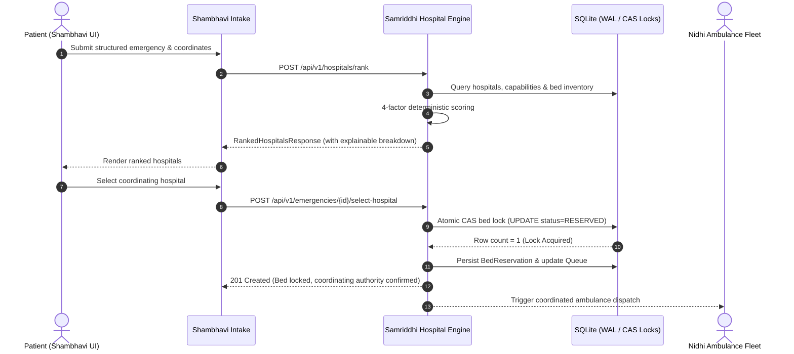

# SirenSync — Hospital Intelligence & Bed Management Architecture

**Author / Subsystem Owner:** Samriddhi (EquiMed Team)  
**Course:** OSDBMS-V-2026-TO76  
**Module:** Hospital Intelligence + Resource / Bed Management  
**Branch:** `feature/samriddhi-hospital`

---

## 1. System Overview & Scope Boundary

The Hospital Intelligence & Bed Management subsystem is the central coordinating authority for patient reception, resource reservation, and explainable hospital ranking in SirenSync.

### Clear Subsystem Boundaries
* **Shambhavi (Patient Experience + Emergency Intake):** Owns patient registration, intake UI, symptom input, and patient hospital selection UI. Invokes our ranking and selection endpoints.
* **Samriddhi (Hospital Intelligence + Bed Management — THIS MODULE):** Owns hospital directory, capabilities, bed states, deterministic 4-factor ranking engine, concurrency-safe bed locking, priority queue, and the 40% route-progress prototype reassignment policy engine.
* **Nidhi (Ambulance Coordination + Live Tracking):** Owns ambulance fleet, dispatch coordination, live route tracking, and consuming our machine-readable rerouting events (`BED_REASSIGNMENT_REROUTE`).
* **Ishita Bisht (AI Traffic + Green Corridor):** Owns YOLO detection on sample footage and traffic signal state simulation.

---

## 2. Core Workflow & Sequence



---

## 3. Database Schema & Relational Integrity

The data layer is built with SQLAlchemy ORM over SQLite with Write-Ahead Logging (`WAL` mode) and a 5000ms busy timeout.

### Core Tables
1. **`hospitals`**: Hospital identity, name, geographic coordinates, and contact details.
2. **`hospital_capabilities`**: Clinical capability codes (e.g. `CARDIAC_CATH_LAB`, `ICU_VENTILATOR`, `TRAUMA_LEVEL_1`, `STROKE_UNIT`, `BURN_CARE`, `NEUROSURGERY`).
3. **`beds`**: Bed inventory, bed type (`ICU`, `TRAUMA_EMERGENCY`, `OXYGEN_HDU`, `GENERAL_WARD`, `PEDIATRIC_ICU`), and status (`AVAILABLE`, `RESERVED`, `OCCUPIED`, `MAINTENANCE`).
4. **`emergencies`**: Shared cross-module emergency record created by Shambhavi's intake.
5. **`bed_reservations`**: Audit trail of bed reservations, statuses, and reassignment linkages.
6. **`hospital_queue_items`**: Live incoming triage queue, emergency priority (`P1` to `P4`), and route progress.
7. **`reassignment_audit_logs`**: Permanent log of all reassignment evaluations, route progress, thresholds, and decisions.

---

## 4. Transaction-Safe Concurrency & Bed Locking Design

### Problem Solved
Application-level checks like `if bed.status == "AVAILABLE": bed.status = "RESERVED"` are vulnerable to race conditions under concurrent requests. Two simultaneous emergency requests could both read `AVAILABLE` and double-book the same bed.

### Solution: Atomic Compare-and-Swap (CAS)
In `backend/services/bed_service.py`, bed reservation is executed within a single database transaction using an atomic conditional update:

```sql
UPDATE beds
SET status = 'RESERVED',
    version = version + 1,
    updated_at = :timestamp
WHERE id = :candidate_bed_id
  AND hospital_id = :hospital_id
  AND status = 'AVAILABLE';
```

1. **Deterministic Lock Acquisition:** The database engine executes the filter and update atomically.
2. **Row Count Verification:**
   - If `rowcount == 1`: Lock acquired! The reservation record is inserted and queue updated in the same atomic commit.
   - If `rowcount == 0`: Another thread claimed the bed milliseconds earlier. The transaction immediately rolls back and either attempts the next candidate bed or returns `409 Conflict`.
3. **Rollback Guarantee:** If any error occurs while recording the reservation, the entire transaction is rolled back; the bed is never left in a partial `RESERVED` state.

---

## 5. 40% Route-Progress Prototype Bed Reassignment Policy

### Policy Disclaimer
> **PROTOTYPE POLICY DISCLAIMER:**  
> The 40% route-progress threshold is a configurable system prototype heuristic designed to demonstrate multi-agent emergency coordination. It does not constitute a clinical, medical, legal, or scientifically validated rule.

### State Transitions & Policy Logic
When a higher-priority emergency (`P1_CRITICAL`) contends for the only reserved bed held by a lower-priority emergency (`P3_URGENT`):
1. **Route Progress Check:** The ambulance route progress of the displaced emergency is checked.
2. **If `route_progress < 40.0%`:**
   - Reassignment is **APPROVED**.
   - Displaced reservation transitions to `RELEASED_FOR_REASSIGNMENT`.
   - Bed is allocated to the higher-priority emergency (`RESERVED`).
   - Ranking engine identifies the next best alternative hospital for the displaced patient.
   - Audit record is written to `reassignment_audit_logs`.
   - Machine-readable `BED_REASSIGNMENT_REROUTE` event is published for Nidhi's ambulance subsystem.
3. **If `route_progress >= 40.0%`:**
   - Reassignment is **REJECTED**.
   - Displaced patient retains the bed reservation to protect coordination stability.
   - Incoming emergency is routed to the next best eligible facility.
   - Decision is logged in `reassignment_audit_logs`.
